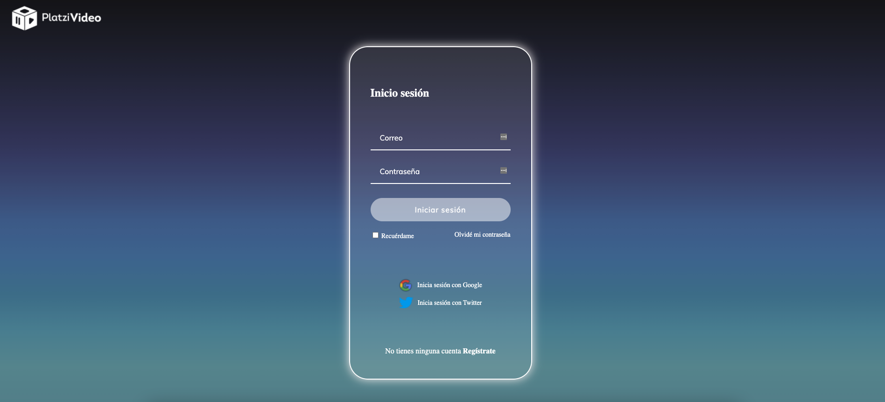
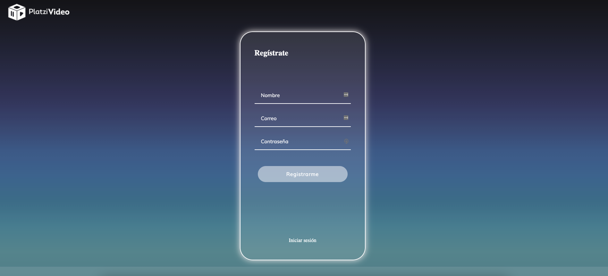

# Platzi video

Contiene el diseño de las interfaces de usuarios para la app de PlatziVideo, generado con el curso de Platzi [Frontend Developer 2019](https://platzi.com/clases/frontend-developer-2019/)

### Appearance
Login:

Registrar:

Home:

No Found:

## Technology
* CSS : Implementada con arquitectura [BEM](https://9elements.com/bem-cheat-sheet/) 
* HTML 5

## Adicionales

- Autor: **Soraimar Bernal**
- [Certificado](https://platzi.com/p/soraimar/curso/1640-frontend-developer-2019/diploma/detalle/)

